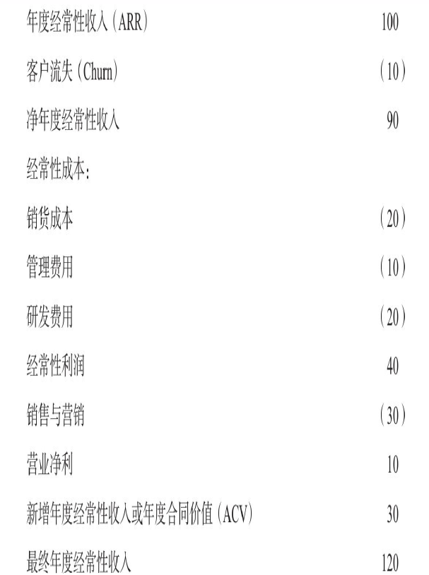

## Zien's Subscription Mode
最近看了左霆的《订阅经济：创造可持续增长的未来》，有颇多的想法。整体上这边书介绍了订阅经济的商业模式和可行性, 我对第二部分的内容关于如何建立“订阅文化”比较感兴趣，因为它教你如何去建立公司文化、组织架构和其他种种可能遇到的问题及挑战。当然，作为一本主要推销作者个人和公司的书籍，对于“How”这一部分作者还是浅尝辄止，有些点不够深入。可能正是这样，读者意识到了问题但是不知道怎么去做，才可能更加让读者去购买他公司的产品吧~

### 订阅模式的财务指标
获客成本、生命周期客户价值、年经常性收益、每位客户带来的平均收益

### IT运营转变
IT基础设施需要是以客户为中心建立的，而非围绕产品销售建立的。所以传统的IT组织架构需要往`PADRE`方向转变，他们分别是，后面会有详细介绍。需要支持的是这个架构比较适合互联网企业，大型非互联网集团公司可能需要相应调整，但是整体方向不变。
- Pipeline渠道
- Acquire获客
- Deploy部署
- Run运营
- Expand扩展

### Innovation: always in Beta
敏捷产品开发的一个关键就是在最终产品上线前有客户和利益相关者参与开发过程，目标是了解异常情景，帮助实现质量保证。学习gmail那样始终处于beta版本，始终让客户参与开发提升产品功能和质量。

### customer-centric
客户作为永远的创新伙伴, 创新不会凭空发生，它是一个概念在一段时间内持续迭代的结果。让产品永远处于测试状态中。

### Rules for subscription services
个体互动高于流程和工具、可运行的软件高于详尽文档、客户合作高于合同谈判、响应变化高于遵循计划。

### 营销4P的改变
产品、价格、渠道、促销（4P）将随着产品向服务转变也相应做出改变。
#### 对渠道商的改变
以工作坊、白皮书、研讨会等方式培训渠道商订阅模式的通识教育，原有大订单以年度维护计划等额外服务的形式进行。教会经销商如何经营长期的合作关系，而不是每年加签一份合同。一个可行的时间表：前三个月关注转化率，接下来的六个月关注使用率，最后三个月为续费及相关的潜在销售准备打包服务。并且将这些数据分享给经销商。
#### 对促销的改变
需要在社交网络上讲一个成功的故事，特别是把你的服务和用户放进一个更广的社交故事之中。先是气势恢宏的商业转型故事，接下来是市场故事，最后才是产品故事。你想创建一个你自己版本的艺术馆，其目标就是带领参观者按照次序走完“三间屋子”。“第一间屋子”根本不涉及你的公司，它介绍的是你公司所诞生的背景，它讲述的是你在广阔的商业世界中所观察到的一切，恰恰是这些，让你的业务应运而生。只有当你建立了背景之后，才能走进“第二间屋子”，并阐明价值——基于角色和行业的客观效益。现在，你可以再深挖一点儿，给出具体的基于角色的建议、行业趋势及相关案例研究。最后，“第三间屋子”是关于产品自身。
#### 定价的改变
定价与潜在客户无法预算或预估的某个使用参数联系起来。两种基本定价模式：
- 消费驱动型增长（使用提升），以量取胜
- 功能驱动型增长（服务创新），理想的情况是，假如你提供青铜/白银/黄金等级服务，70%的订阅用户都在白银和黄金类别中。

### 销售
资产转移模式转向长期的关系。对于订阅模式，销售更需要做的事：
- 获得更多的客户
- 提升这些客户的价值
- 更长久地拥有这些客户

需要采取多种策略来维持增长。他们分别是：
- 选择合适的初始客户。如选择小型一些的企业，他们作为初始用户，不会像大公司那样需要面面俱到的功能和服务，导致本企业无法支持而倒闭。同时刚开始控制销售团队规模，让这些销售和客户建立长期关系而不是基于拿到佣金。
- 降低客户流失率。降低客户流失率一个很关键的问题在于用户采纳程度，所以需要团队培训客户更好地使用产品。同时配合销售组合，通过广泛的解决方案解决广泛的问题的能力可以降低客户流失率。
- 扩大销售团队。扩大销售团队时需要注意提升混合销售模式（传统销售模式和自助式销售），并且提升自动化来帮助内部销售流程运作。
- 通过追加销售和交叉销售实现增值。追加销售指功能更丰富且价格更高的升级服务。交叉销售是指销售额外的服务，提供更加全面的解决方案策略，希望拥有交叉销售能力的订阅式企业，需要不断增加新的服务、特点、功能和内容，从而吸引客户从服务中获得更多价值。在成熟的订阅服务中，追加销售和交叉销售平均可以带来20%的收入。同时还有其他好处，包括降低客户流失率，从而降低你的获客成本。负责管理现有客户的销售可以叫“客户成功经理”。
- 进入新的细分市场。
- 走向国际。需要考虑第一，监管相关的内容——营业执照、税收、数据驻留要求；第二，支付相关的内容——替代支付网关、当地货币、信用卡等等；第三，店铺本身——人力资源、员工聘用等等。
- 将收购带来的增长机会最大化。
- 优化定价与打包组合。订阅式企业需要通过定价持续优化收益

### 订阅经济利润表
年度经常性收入`Annual recurring revenue`和月度经常性收入`Monthly recurring revenue`是订阅经济利润表核心。具体公示表现为：
```
ARRn+1 = ARRn - Churn + ACV(Annual contract value)
```
因为订阅经济认为营销和销售的投入会提升下一年ACV,同时它们也不会作为经常性成本，而是增长成本，而增长成本对未来的经常性收入有直接的帮助。所以`ACV = sales&marketing * rate`, 对于企业而言，如何提升销售和营销的投入对未来订阅合同的转化率至关重要。
简化的订阅利润表为：


### PADRE/PPM运营模型
以客户为中心的组织架构可以由8大子系统有机组成，由PADRE+3个基本部分PPM组成。公司的组织不一定完全按照这个模式设立，但是这8个子系统是必须有的基础，并且可以跨功能协作。
- Pipeline渠道。子系统的主要目标是建立市场意识，并转化为需求。具体渠道包括网络和社交媒体，公共关系，事件营销。
- Acquire获客。就是所谓的“买家之旅”。潜在客户是如何做决策的？他们成功的标准是什么？他们还有什么替代解决方案？什么可能是他们反对的？他们必须向谁进行确认？他们的伴侣？家人？老板？首席财务官？还是团队？
- Deploy部署。
- Run运营。持续运营能力对于客户的体验至关重要。
- Expand扩展。。你需要你的订阅用户能够做三件事：留下、增长、支持。
三个基础部分包括：人、产品和钱。

基于PADRE模型，运营公司就知道要关注渠道覆盖、销售数据、新采用的商标、客户保留统计数据、扩展速度，并且分享给公司每个人。建立PADRE这种文化确保有利于组织发展的知识不会过于分散。
